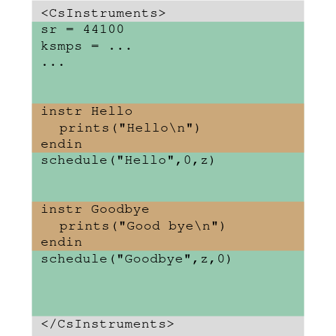

this is a collection of docs and examples of creating svg files
(perhaps rendered as png) via python.

they are based on [draw2Svg](https://github.com/aufarah/draw2Svg) which is itself
a fork of [drawSvg](https://github.com/cduck/drawSvg), but putting y=0 as it is
in svg, so on top.

the draw2Svg sources are copied 
[here](draw2Svg) for convenience, but what i collect here
are contributions for documentation and examples.

## draw2Svg Quick Reference 

[website](https://joachimheintz.github.io/svg/)

[as jupyter notebooks](docs/quickref_nb)

## Examples

### from svg essentials

[jupyter notebooks](examples/svg_essentials) transforming examples from eisenberg's book.

### from csound floss manual

while writing the first ten tutorials of the new Getting Started in the 
[csound floss manual](https://flossmanual.csound.com) i created a lot of plots
and figures with draw2Svg. i put some of them [here](examples/csound_floss_manual).

## functions

ongoing collection in [lib](lib) for my needs, perhaps some of them useful for others.

